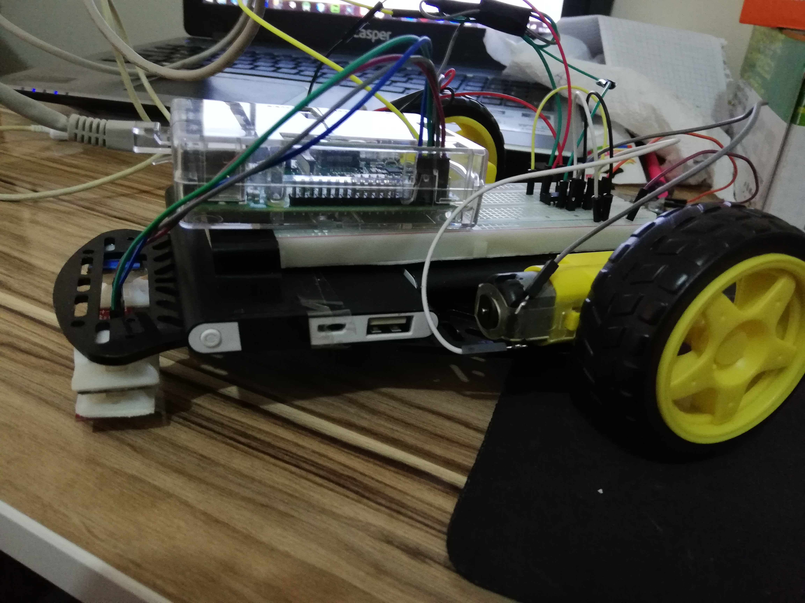
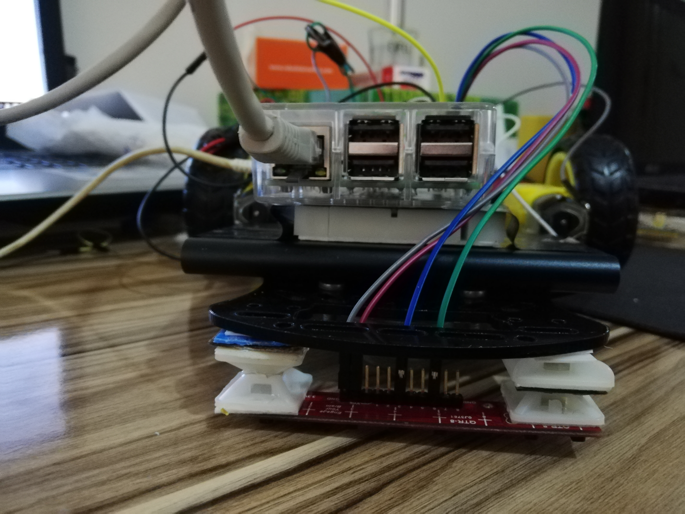
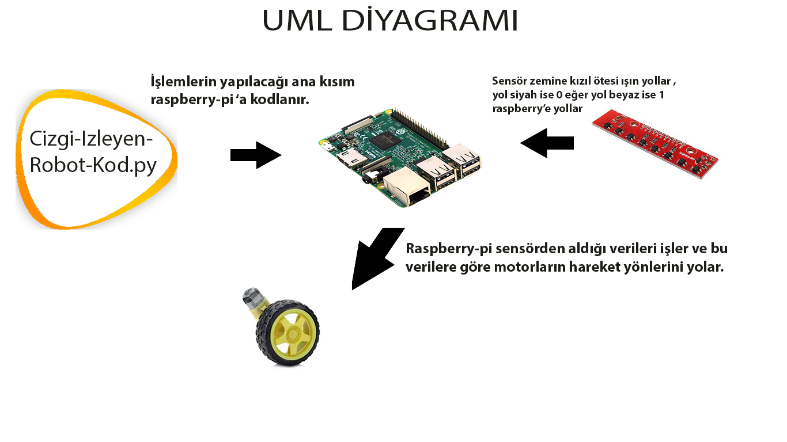
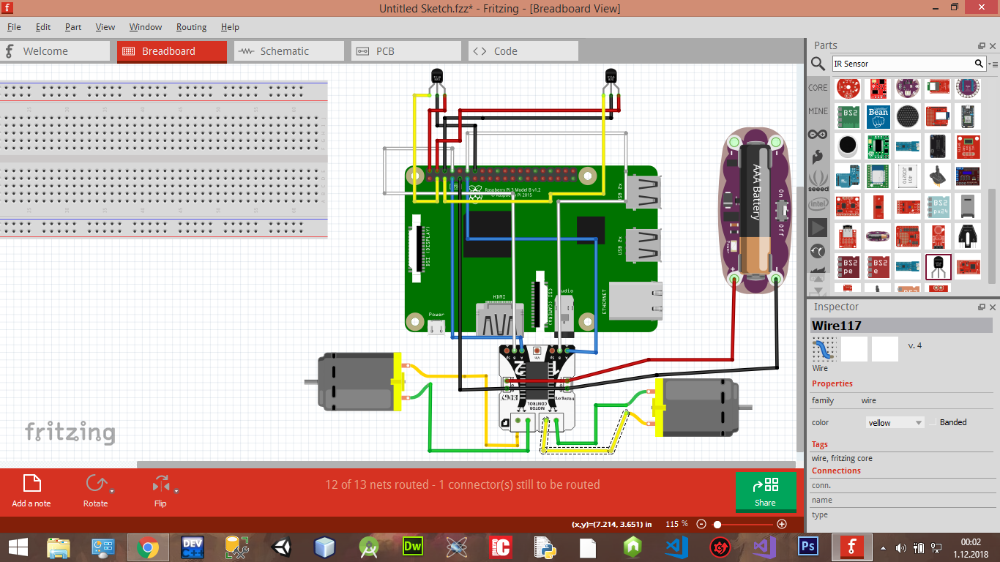

# Cizgi-izleyen-robot
Raspberry-pi 3, Python kullanılarak geliştirilmiş Çizgi İzleyen Robot
## Projenin Genel Tanımı ve Amacı
Raspberry-pi 3 üzerinde Python dili kullanılarak Çizgi İzleyen Robotun tasarımı ve kodlaması. Beyaz zemin üzerindeki siyah çizgi üzerinde ilerleyen ve rotadan çıkmayan robotik araç tasarımı
# Çizgi izleyen Çalışması

## Çizgi izleyen gerçeklemesi

## Kullanılan Teknolojiler 
- Raspberry-pi 3
- Python 
- Fritzing
- Visual Studio Code
- Motor Sürücüsü (L293D)
- QTR-8A Kızıl ötesi sensör
- Dc Motor
- Robot Gövdesi
- Rasbian
### Kullanılan Kütüphaneler
- import RPi.GPIO as IO
- import time
## Sistem Bileşen Diyagramı 

## Sistem DEvresinin Fritzing Programında Kurulumu

## Projenin Uygulama Aşamaları
1) Python ve Raspberry-pi 3 ile çizgi izleyen robot yapımı hakkında araştıırma yapıldı. 
2) Yapılan araştırma üzerine belirlenen malzemeler belirlenen ölçüler doğrultusunda tedarik edildi. 
3) Raspberry-Pi Çizgi izleyen robot Devre Şeması yapıldı.
4) Visual Studio Code kullanılarak projenin Python kodları yazıldı.
5) Donanımsal olarak bileşenleri birleştirme ve kodların Raspberry-pi 3'e aktarılması üzerinde çalışmaya devam ediliyor.
## Kaynaklar
Fritzing için;
- https://www.youtube.com/channel/UCIBNyQal8YBosUrY44dTS5A

Raspberry-pi için;
- https://www.youtube.com/channel/UChklsLaaAUw8fWw2LHnun4Q

